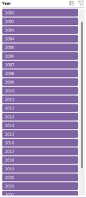

# AGRICULTURE_DATA-ANALYSIS-DASHBOARD

## Problem Statement
I have developed an agriculture data analysis dashboard using Microsoft Excel. The dashboard efficiently organizes and visualizes critical data for agricultural insights. It includes key metrics like crop yield trends, weather patterns, and soil health analysis. Advanced Excel features such as pivot tables, charts, and conditional formatting have been utilized to enhance data interpretation. This project aims to support informed decision-making for farmers and stakeholders. It highlights my expertise in data analysis and dashboard creation for real-world applications.

 ## Dataset used
The collection of agriculture data from 2000 to 2023 consists of rainfall, fertilizers, crop cultivation, temperature, and soil PH. The data is categorized by regions and crops.

## Analyses derived from the dataset

## FILTERS
                                                                      
                                                                      

                                                                     

                                                                     

**OVERVIEW**

**DASHBOARD**

                                                                     
                                                                    

**YEAR FILTER**

                                                                    
                                                                   

**REGION FILTER**

                                                                   

**DATA SET**

                                                                    

**PIVOT TABLE**

                                                                    
